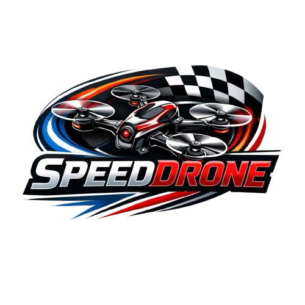

# SpeedDrone — Sistema Intelligente di Rilevamento per Gare FPV 🏎️🚁 

**Progetto Scolastico — Classe 5B | Anno Scolastico 2025/2026**
*Indirizzo: Struttura e Costruzione del Mezzo Aereo*



## 📖 Il Progetto
**SpeedDrone** nasce dall\'esigenza di risolvere un problema reale nel mondo del Drone Racing FPV: gli attuali sistemi professionali di cronometraggio e rilevamento dei gate sono estremamente costosi e poco accessibili ai principianti. 

Questo progetto unisce l\'elettronica, la programmazione e le tecnologie aero-spaziali per creare un **sistema di rilevamento passaggi (gate detection) a basso costo**, basato su microcontrollori ESP32 e diodi laser. L\'obiettivo è permettere a scuole, piccoli club e appassionati di organizzare gare con infrastrutture professionali ed economiche.

## 🚀 Come Funziona
Il sistema si divide in 3 fasi principali:
1. **Fascio Laser & Sensore:** Un diodo laser puntato verso un sensore fotoresistivo crea una "barriera" invisibile attraverso il gate.
2. **Interruzione del Fascio:** Quando il drone attraversa il gate, interrompe il fascio laser per una frazione di secondo.
3. **Rilevamento ESP32:** Il microcontrollore rileva il calo di tensione, scatta il tempo di passaggio e lo invia al sistema centrale.

## 🛠️ Tecnologia Utilizzata
Il progetto fonde hardware e software per funzionare in perfetta sinergia:
* **Hardware:** Microcontrollori ESP32, sensori fotoelettrici, diodi laser 5V.
* **Sviluppo Web (Questa Repository):** Frontend moderno sviluppato come SPA (Single Page Application) veloce e reattiva.
  * **React & Vite:** Per prestazioni estreme e modularità.
  * **TailwindCSS:** Per lo styling e design system coerente.
  * **Framer Motion:** Per animazioni fluide e interazioni dinamiche.
* **Drone Racing FPV:** Conoscenza dell\'aerodinamica e delle manovre ad alta velocità dei quadricotteri.

## 💻 Come eseguire il sito localmente (Sviluppo)
Questo sito web funge da landing page per illustrare il progetto.

**Requisiti:** Node.js (v18 o superiore raccomandato).

1. Clona la repository.
2. Installa le dipendenze:
   ```bash
   npm install
   ```
3. Avvia il server di sviluppo locale:
   ```bash
   npm run dev
   ```
4. Apri `http://localhost:5173` nel tuo browser.

## 🐳 Esecuzione tramite Docker (Produzione)
Il progetto include una configurazione Docker pronta per l\'uso, che costruirà il sito e lo servirà tramite un web server leggero (Nginx).

1. Costruisci l\'immagine Docker:
   ```bash
   docker build -t speeddrone-web .
   ```
2. Avvia il container:
   ```bash
   docker run -d -p 8080:80 --name speeddrone speeddrone-web
   ```
3. Il sito sarà accessibile all\'indirizzo `http://localhost:8080`.

## 🔋 I Nostri Valori
Questo progetto va oltre il semplice lato tecnico. Abbiamo affrontato questa sfida guidati da tre valori chiave:
* **Teamwork:** La collaborazione è stata fondamentale per unire competenze diverse (dal frontend all\'elettronica).
* **Passione:** Un motore essenziale, soprattutto l\'interesse per la tecnologia, l\'aeronautica e gli aerei.
* **Innovazione:** Abbiamo dimostrato che con creatività, anche tra i banchi di scuola si possono creare soluzioni smart e funzionanti.

---
*Progettato, realizzato e programmato con ❤️ dalla Classe 5B.*
